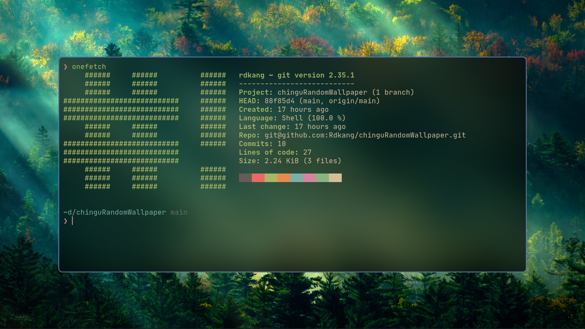

# chinguRandomWallpaper

blazing fast and simple/extensible, script to set the wallpaper 🌄

##### origin of the name

> **chingu** means **friend** in korean



## Usage

can use a program such as [xbindkeys](https://wiki.archlinux.org/title/Xbindkeys) to run this script
E.g.

```bash
"~/Documents/chinguRandomWallpaper/randomWallpaper.sh"
alt+w
```

###### see what the current wallpaper is

shows the file path of the current file and copys it to the clipboard so do some actions such as move or rename it

```bash
  alias currentwall="readlink ~/.local/share/wallpaper ; readlink ~/.local/share/wallpaper | xclip"
# E.g. will return
# /home/rdkang/Pictures/Wallpapers/cozyAndgood/cozy-house-rain.jpg

```

### wallpaper at boot

to have the wallpaper be set after booting add `setWallpaper.sh` to your `.xinitrc` or using desktop environments autostart

## Installation

1. clone or download the files

   `$ git clone https://github.com/Rdkang/chinguRandomWallpaper.git`

2. run the file called **randomWallpaper.sh**

   `$ ./randomWallpaper.sh`

3. thats it! :)

## Requirements

- any modern linux distro
- xwallpaper
- imagemagick
- find
